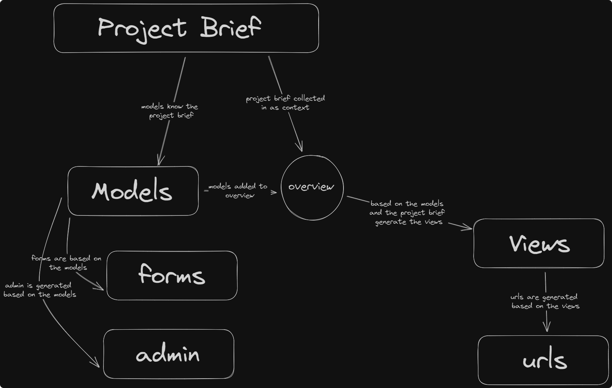

# Assisted Django

Given a proper project brief, and the location of the **Django App** this script will automatically automatically update
the `models.py`, `views.py`, `urls.py`, `admin.py` `tests.py` and `forms.py` files.

> This script does not do anything to the Project Directory, it only updates the content in a Django App Directory.

This script is very opinionated at how it does things. This is not a fully automated solution, but I think it could
significantly reduce the time it takes to create a Django App.

> Spend a good amount of time planning the project in the brief, and the script will basically write the models, views,
> urls, admin, tests and forms for you. (You will still likely need to make changes)

### How this works in a diagram



### Example Video

<video width="500" height="500" src="https://github.com/fauzaanu/assisted-django/blob/main/.README_images/assisted%20django.mp4" controls>
  Your browser does not support the video tag.
</video>


### TODO

- [x] Remove the markdown code comments that are generated by GPT-3
- [ ] Templates should also be created

### Your workflow to use this properly

1. **Install Django**: `pip install django`
2. **Create a Django Project**: `django-admin createproject Project`
3. **Navigate to the Project Directory**: `cd Project`
4. **Create a New App**: `python manage.py startapp appname`
5. **Create a README.md or a textfile**: This file should contain a brief description of the project and its purpose.
   Try to highlight the database design in this file, and features.
6. **Create a .env file**: This file should contain the `OPENAI_API_KEY`
7. If the project is rather complex, overide the default model from gpt-3 to gpt-4. (Or write better briefs?)

##### Example of how to run this:

```python
from AssistedDjango.DjangoApplication import DjangoApplication


def enhance_django_app():
    app_name = "django_app_name_here"  # replace with your actual Django app name
    app_directory = "Basic/manual_checklist"  # replace with your actual Django app directory
    # basic is the Project Directory
    # manual_checklist is the Django App Directory
    # This script does not do anything to the Project Directory

    with open("checklist", "r") as f:  # replace with your actual project brief
        purpose = f.read()

    django_app = DjangoApplication(app_name, purpose, app_directory)
    django_app.generate()


if __name__ == '__main__':
    enhance_django_app()
```

This repo already has django in the requirements.txt file, so you can just clone this repo and test within the repo
directory.